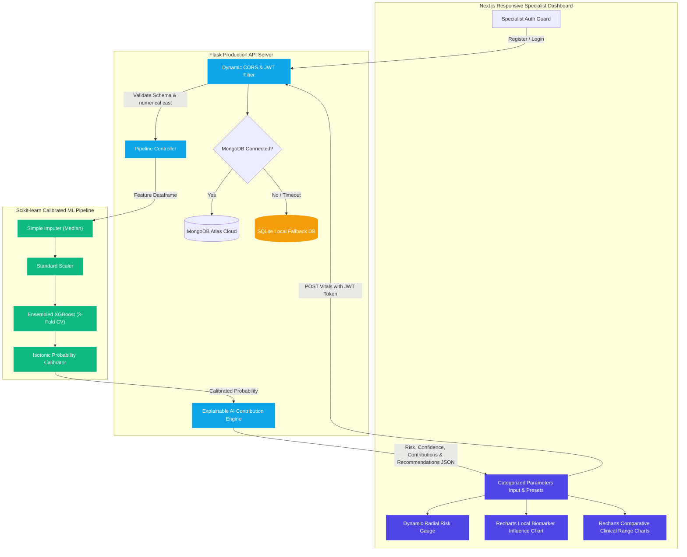

# HeartAI: Calibrated Heart Disease AI Diagnostic & Analytics Platform

[](https://github.com)
[](https://nextjs.org)
[](https://xgboost.readthedocs.io)
[](https://github.com)
[](https://sqlite.org)

HeartAI is a medical platform designed to assist cardiologists and healthcare specialists in early coronary artery disease screening. By bridging standard clinical parameters (resting vitals, stress tests, demographics) with an ensembled **Calibrated XGBoost Classifier**, HeartAI returns highly accurate probability calculations, local **Explainable AI (XAI)** biomarker contributions, and programmatically tailored clinical lifestyle recommendations.

---

## 🏗️ Systems Architecture & ML Pipeline



---

## 🌟 Key Application Features

1. **Healthcare-Branded Dashboard Portal**: Sleek typography, spacing, customized inputs, responsive double-panel grid layouts, and active specialist login sessions.
2. **Double-Calibrated XGBoost Model**: Leverages 3-fold cross-validated probability calibration (Isotonic Regression) over ensembled extreme gradient boosted trees to output highly reliable clinical risk percentages.
3. **Local Explainable AI (XAI)**: Evaluates the specific patient parameters against optimal biological baselines, normalized by global feature importances, to output a clear horizontal Recharts bar chart showing exactly which metrics drove risk calculation upwards.
4. **Tailored Clinical Advice**: Programmatically issues high-impact warning logs and lifestyle recommendations (blood pressure adjustments, lipid panels, coronary screening alerts) based on the patient's anomalous markers.
5. **Zero-Configuration SQLite Fallback**: Automatic, zero-configuration local database initialization if MongoDB Atlas is offline, allowing registration, login, and auth validation to work instantly.
6. **Autofill Patient Profiles (Demo Presets)**: Fast demo loaders enabling reviewers to click a profile (e.g. *Healthy Athlete*, *Borderline Risk*, *Critical Cardiac*) to instantly populate the form and evaluate outcomes.
7. **Model Transparency Metrics**: Visual confusion matrices, sensitivity analyses, and interactive ROC Curves showing the technical pipeline configurations.

---

## 💻 Interactive Screenshot Section

Prepare local screenshot capture placements:

### 1. Diagnostic Portal Dashboard
*(Autofill presets, organized demographics, vitals, and stress performance parameters ready for diagnostic compilation)*
`[Placeholder: C:\Users\Hemalatha P\Desktop\Improve\heart-frontend\public\screenshot_dashboard.png]`

### 2. Explainable AI Clinical Risk Assessment
*(Animated radial risk gauge, confidence indicators, Recharts local biomarker influence metrics, and tailored medical lifestyle recommendations)*
`[Placeholder: C:\Users\Hemalatha P\Desktop\Improve\heart-frontend\public\screenshot_prediction.png]`

### 3. Patient Vitals Comparison Charts
*(Interactive Recharts comparing resting blood pressure, cholesterol count, and maximum heart rate achieving levels against normal medical thresholds)*
`[Placeholder: C:\Users\Hemalatha P\Desktop\Improve\heart-frontend\public\screenshot_analytics.png]`

### 4. Technical Model Performance Reports
*(Interactive ROC curves, precision/recall grids, low false-negative confusion matrix logs, and pipeline architectures)*
`[Placeholder: C:\Users\Hemalatha P\Desktop\Improve\heart-frontend\public\screenshot_performance.png]`

---

## 🛠️ Installation & Local Running Guide

### Prerequisites
* Python 3.10+ (PIP environment)
* Node.js 18+ (NPM package manager)

### 1. Initialize and Run the Backend API
Navigate to the backend directory, install requirements, and boot up the server:
```bash
# Move to backend
cd heart-backend

# Install python dependencies
pip install -r requirements.txt

# Start the Flask API with UTF-8 support
python -X utf8 app.py
```
> [!NOTE]
> The backend server will automatically check if the model pipeline loads correctly. If it detects scikit-learn version mismatches from serialized files, it will **automatically retrain the calibrated pipeline** on `Data/heart.csv` on the fly to match your system specs.
>
> If MongoDB is unreachable, it will trigger the fallback, initializing `heart_disease.db` locally.

### 2. Initialize and Run the Next.js Frontend
Navigate to the frontend directory, install dependencies, and start the development server:
```bash
# Move to frontend
cd ../heart-frontend

# Install dependencies (ignoring conflicts with React 19)
npm install --legacy-peer-deps

# Start Next.js development server
npm run dev
```

The application is now running locally:
* **Frontend Portal**: `http://localhost:3000`
* **Healthcare API**: `http://localhost:5000`

---

## 🚀 Production Deployment Instructions

### Frontend → Vercel
1. Install the Vercel CLI or link your repository to the [Vercel Dashboard](https://vercel.com).
2. Set the root directory to `heart-frontend`.
3. Configure the following environment variable:
   * `NEXT_PUBLIC_API_URL` = `https://your-backend-render-url.onrender.com`
4. Deploy the project. The build configurations will automatically execute `next build` and optimize files.

### Backend → Render / Railway
1. Create a Web Service on [Render](https://render.com) linked to your repository.
2. Set the root directory to `heart-backend`.
3. Set the **Build Command** to:
   ```bash
   pip install -r requirements.txt && python -X utf8 train_model.py
   ```
4. Set the **Start Command** to:
   ```bash
   gunicorn app:app --bind 0.0.0.0:$PORT
   ```
5. Configure the following environment variables:
   * `JWT_SECRET_KEY` = `your-custom-production-jwt-hash-key`
   * `MONGO_URI` = `your-mongodb-atlas-connection-string` (Leave blank to use persistent local SQLite storage)
   * `ALLOWED_ORIGINS` = `https://your-frontend-vercel-url.vercel.app,http://localhost:3000`
6. Deploy the web service.

---

## 🔮 Future Cardiac Research Roadmap
* **Wearable Real-time Sync**: Integrating wearable sensor APIs (Apple HealthKit, Fitbit) to log resting heart rate and blood pressure trends continuously.
* **Deep Learning ECG Analysis**: Implementing ensembled multi-channel convolutional neural networks (CNNs) to analyze raw 12-lead ECG wave waveforms.
* **Cardiology PDF Exports**: Compiling elegant, print-ready clinician diagnostic summaries in PDF format complete with signature blocks.
